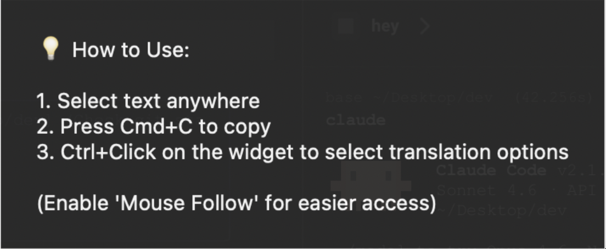
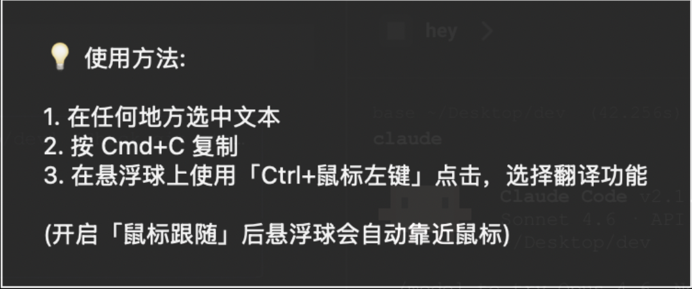

# Vibe Translator

[English](#english) | [中文](#中文)

---

## English

A macOS menu bar translation application powered by **Google Gemini** (Supports both Google AI Studio API Keys and Google Cloud Vertex AI) and local **Ollama** models.

### Screenshots

<div align="center">
  
  &nbsp;&nbsp;&nbsp;&nbsp;
  
  &nbsp;&nbsp;&nbsp;&nbsp;
  
  <p><i>Left: Floating widget. Middle: Translation window. Right: Usage instructions.</i></p>
</div>

### Features

- 🌍 **Menu Bar Integration** - Lives in your macOS menu bar
- 🎈 **Floating Widget** - Persistent, draggable desktop widget that expands to show translations instantly without spawning new windows
- 🖱️ **Widget Context Menu** - Hold Ctrl to move to the widget, then Ctrl+Click to access all translation options directly without reaching for the menu bar
- 🌐 **Bilingual UI** - Easily toggle the entire application interface between English and Chinese
- ⏳ **Real-time Streaming** - UI instantly expands to show the original text and streams the translation back chunk-by-chunk for an immediate, type-writer effect.
- 🦙 **Local AI Support** - Optionally toggle on "Local AI" to route translations through your local **Ollama** server instantly, completely offline.
- 👻 **Omnipresent** - Strictly stays above all other apps and follows you across all macOS Spaces/Desktops automatically
- 🔄 **Multi-Language Support** - Auto-detect to Chinese, plus translation between Chinese, English, and German
- 🛠️ **Custom Languages & Styles** - Easily add your own language pairs and define custom translation prompts (tones/styles) via the built-in UI
- 🎨 **Style Options** - Choose translation tones dynamically from the expanded UI dropdown
- 🎯 **Text Selection** - Select text anywhere and translate instantly
- 💬 **Elegant UI** - Clean, theme-aware dialog with resizable windows
- ⚡ **Fast Translation** - Powered by Gemini 3.1 Flash Lite Preview
- 🔑 **No Third-Party Dependencies** - Completely independent. No subscription to third-party tools required. Simply use your own enterprise Google Cloud Vertex AI credentials, or get a free API Key from [Google AI Studio](https://aistudio.google.com/u/0/api-keys) to start translating immediately.
- 🌓 **Theme Support** - Automatically adapts to macOS dark/light mode

### Installation

1. **Clone the repository**
```bash
git clone git@github.com:XinyueZ/vibe-translator.git
cd vibe-translator
```

2. **Create virtual environment and install dependencies**
```bash
python3 -m venv venv
source venv/bin/activate
pip install -r requirements.txt
```

3. **Configure environment variables**

Create a `.env` file with your credentials:
```bash
cp .env.example .env
```

Edit `.env` and configure your preferred AI provider:

**Option A: Google AI Studio (Easiest)**
```
GOOGLE_GENAI_USE_VERTEXAI=False
GOOGLE_AI_STUDIO_API_KEY=your_api_key_here

GEMINI_MODEL=gemini-3.1-flash-lite-preview
```

**Option B: Google Cloud Vertex AI (Enterprise)**
```
GOOGLE_GENAI_USE_VERTEXAI=True
GOOGLE_CLOUD_PROJECT=your-project-id
GOOGLE_CLOUD_LOCATION=europe-west3

GEMINI_MODEL=gemini-3.1-flash-lite-preview
```

**Option C: Local AI via Ollama**
If you wish to run translation offline using open-source models, you can configure your Ollama endpoint:
```
OLLAMA_HOST=http://localhost:11434
OLLAMA_MODEL=qwen2.5:1.5b
```
> **⚠️ Note on Ollama**: Please ensure that you have started your Ollama service before attempting to use it for translations. If you receive a connection error, try running `ollama serve` in your terminal.

> **🧠 Smart Location Routing**: If you are using Vertex AI and set `GEMINI_MODEL` to a name containing `-preview` (e.g., `gemini-3.1-flash-lite-preview`), the app will **automatically override** your `GOOGLE_CLOUD_LOCATION` and route the request to `global`. You do not need to manually change your region when testing preview models!

> **Note for Vertex AI users**: To ensure your Google Cloud authentication remains active, it is recommended to run `gcloud auth application-default login` in your terminal every 24 hours to refresh your credentials. Or use the "Auth 刷新授权" button from the menu bar or widget right-click menu.

4. **Grant macOS Permissions**
   - **Accessibility (For text selection):** Open **System Settings** → **Privacy & Security** → **Accessibility**
   - **Screen Recording (For OCR feature):** Open **System Settings** → **Privacy & Security** → **Screen Recording**
   - Click **+** and add **Terminal** (or your Python executable) to both sections and enable the checkboxes.

### Usage

**Option 1: Double-click launcher (Recommended)**
```bash
# Double-click one of these files in Finder:
run_app.command           # English launcher
启动翻译器.command         # Chinese launcher
```

**Option 2: Terminal**
```bash
source venv/bin/activate
python main.py
```

Keep the Terminal window open (you can minimize it).

**Translation Steps:**

1. You'll see a 🌍 icon in your menu bar (top-right corner) AND a persistent floating 🌍 widget on your desktop
2. You can left-click and drag the floating widget anywhere on your screen
3. Select text anywhere in macOS
4. After selecting text, **hold the Ctrl key** to move your mouse to the widget, then **Ctrl+Click** it (or click the menu bar icon) and choose your translation direction (e.g. Auto-Detect → Chinese)
5. The app instantly expands to show your original text and a loading indicator
6. Once translated, the result appears and is copied to your clipboard
7. Press `Esc` or `Cmd+W` to close the dialog and collapse it back to a floating widget

**Change UI Language:**
Ctrl+Click the floating widget or click the menu bar icon, and select **"UI: English"** or **"界面中文"** to instantly switch the app's interface language.

### Translation Styles

- **German**: Choose between duzen (informal "you", default) or formal Sie
- **Chinese**: Regional accents including Shanghai, Northern/Southern Mainland, Taiwan, Hong Kong
- **English**: American standard, American cowboy style, British standard, British gentleman

### Technology Stack

- **UI Framework**: rumps (menu bar), tkinter (dialogs)
- **Clipboard**: pyperclip
- **AI Model**: Google GenAI SDK with VertexAI
- **Model**: Gemini 3.1 Flash Lite Preview
- **Platform**: macOS

### Requirements

- macOS (tested on macOS 12+)
- Python 3.8+
- Google Cloud account with VertexAI API enabled
- Accessibility permissions

### License

MIT

---

## 中文

一个基于 **Google Gemini** 的 macOS 菜单栏翻译工具（同时支持 Google AI Studio API Key、Google Cloud Vertex AI 两种接入方式，以及本地 **Ollama** 大模型）。

### 界面截图

<div align="center">
  
  &nbsp;&nbsp;&nbsp;&nbsp;
  
  &nbsp;&nbsp;&nbsp;&nbsp;
  
  <p><i>左：常驻桌面的圆菜单。中：瞬间展开的翻译结果主窗口。右：使用方法说明。</i></p>
</div>

### 功能特性

- 🌍 **菜单栏集成** - 常驻在 macOS 菜单栏
- 🎈 **圆组件** - 常驻桌面、可随意拖拽的圆，瞬间展开显示翻译结果，告别反复弹窗
- 🖱️ **圆菜单** - 选中文本后，按住 Ctrl 键移动鼠标至圆上，再保持 **Ctrl+鼠标左键点击** 即可呼出所有翻译选项，无需再将鼠标移至屏幕顶部
- 🌐 **双语界面** - 一键切换应用程序的所有界面为全中文或全英文
- ⏳ **流式输出** - 翻译时瞬间展开窗口，并且像打字机一样分块、流式显示翻译结果，体验极速响应。
- 🦙 **本地 AI 支持** - 支持一键切换至“本地 AI”，通过你的本地 **Ollama** 服务进行完全离线的翻译。
- 👻 **无处不在** - 拥有最高系统层级置顶，且会像“幽灵”一样跨越所有 macOS 桌面空间 (Spaces) 跟随你
- 🔄 **多语言支持** - 自动检测语言并翻译为中文，以及中文、英文、德文互译
- 🛠️ **自定义语言与风格** - 支持在软件内可视化添加任意语言对，并为它们定制专属的 Prompt（语气风格），翻译时随意切换
- 🎨 **风格选项** - 支持在翻译结果界面，一键切换各种内置及您自定义的翻译风格
- 🎯 **文本选择** - 在任何地方选中文本即可翻译
- 💬 **优雅界面** - 简洁、跟随系统主题、可调整大小的对话框
- ⚡ **快速翻译** - 使用 Gemini 3.1 Flash Lite Preview 模型
- 🔑 **无第三方依赖，完全独立** - 本程序完全不需要依赖任何第三方翻译软件或代理服务。只要您有自己的企业级 Google Cloud Vertex AI 后台，或者在 [Google AI Studio](https://aistudio.google.com/u/0/api-keys) 申请了（免费的）API Key，填入配置后即可直接使用！
- 🌓 **主题支持** - 自动适配 macOS 深色/浅色模式

### 安装步骤

1. **克隆仓库**
```bash
git clone git@github.com:XinyueZ/vibe-translator.git
cd vibe-translator
```

2. **创建虚拟环境并安装依赖**
```bash
python3 -m venv venv
source venv/bin/activate
pip install -r requirements.txt
```

3. **配置环境变量**

创建 `.env` 文件并填入你的凭证：
```bash
cp .env.example .env
```

编辑 `.env` 文件，根据你想要使用的 AI 平台进行配置：

**选项 A：Google AI Studio API Key（最简单）**
```
GOOGLE_GENAI_USE_VERTEXAI=False
GOOGLE_AI_STUDIO_API_KEY=你的_api_key

GEMINI_MODEL=gemini-3.1-flash-lite-preview
```

**选项 B：Google Cloud Vertex AI（企业级）**
```
GOOGLE_GENAI_USE_VERTEXAI=True
GOOGLE_CLOUD_PROJECT=你的项目ID
GOOGLE_CLOUD_LOCATION=europe-west3

GEMINI_MODEL=gemini-3.1-flash-lite-preview
```

**选项 C：通过 Ollama 接入本地 AI**
如果你希望使用开源大语言模型进行完全离线的翻译，可以配置你的 Ollama 地址：
```
OLLAMA_HOST=http://localhost:11434
OLLAMA_MODEL=qwen2.5:1.5b
```
> **⚠️ Ollama 注意事项**：在进行本地翻译前，请务必确保已经启动了 Ollama 服务。如果你遇到连接错误提示，请在 terminal 里运行 `ollama serve` 来启动服务。

> **🧠 智能区域路由**：如果您使用 Vertex AI 并且设置的 `GEMINI_MODEL` 名称中包含 `-preview`（例如 `gemini-3.1-flash-lite-preview`），程序会**自动忽略**您配置的 `GOOGLE_CLOUD_LOCATION`，强制将请求路由到 `global` 区域。当您在测试预览版模型时，无需反复手动修改区域配置！

> **Vertex AI 用户注意**：为了确保您的 Google Cloud 身份验证保持有效，建议每 24 小时在终端中运行一次 `gcloud auth application-default login` 以刷新您的凭证。或者使用菜单栏/圆右键菜单中的 "Auth 刷新授权" 按钮。

4. **授予 macOS 系统权限**
   - **辅助功能（用于划词翻译）：**打开 **系统设置** → **隐私与安全性** → **辅助功能**
   - **屏幕录制（用于截图翻译）：**打开 **系统设置** → **隐私与安全性** → **屏幕录制**
   - 分别点击 **+** 添加 **Terminal**（或你的 Python 可执行文件）并勾选启用。

### 使用方法

**方式一：双击启动器（推荐）**
```bash
# 在访达中双击以下文件之一：
run_app.command           # 英文启动器
启动翻译器.command         # 中文启动器
```

**方式二：终端**
```bash
source venv/bin/activate
python main.py
```

保持终端窗口打开（可以最小化）。

**翻译步骤：**

1. 你会在菜单栏右上角看到 🌍 图标，并且在桌面上会看到一个常驻的 🌍 圆
2. 你可以按住鼠标左键随意拖拽圆
3. 在 macOS 任何地方选中文本
4. 选中文本后，**按住 Ctrl 键**将鼠标移至圆上，并保持 **Ctrl+鼠标左键点击**以打开翻译选项（如：自动检测 → 中文）
5. 圆会瞬间展开，显示你选中的原文和加载动画
6. 翻译完成后，结果会自动显示并复制到剪贴板
7. 按 `Esc` 或 `Cmd+W` 关闭结果窗口，它会自动缩回变成圆

**切换界面语言：**
Ctrl+鼠标左键点击圆或点击顶部菜单栏，选择 **"界面英文"** 或 **"UI: Chinese"** 即可瞬间切换界面的语言。

### 翻译风格

- **德文**：可选 duzen（非正式"你"，默认）或正式 Sie 口吻
- **中文**：地域口音包括上海海派、大陆北方/南方、台湾腔、港台腔
- **英文**：美国普通式、美国牛仔式、英国普通式、英国绅士口吻

### 技术栈

- **UI 框架**: rumps（菜单栏）、tkinter（对话框）
- **剪贴板**: pyperclip
- **AI 模型**: Google GenAI SDK with VertexAI
- **模型**: Gemini 3.1 Flash Lite Preview
- **平台**: macOS

### 系统要求

- macOS（在 macOS 12+ 测试）
- Python 3.8+
- 开通 VertexAI API 的 Google Cloud 账号
- 辅助功能权限

### 许可证

MIT

---

## Stats


## Star History

<a href="https://star-history.com/#XinyueZ/vibe-translator&Date">
 <picture>
   <source media="(prefers-color-scheme: dark)" srcset="https://api.star-history.com/svg?repos=XinyueZ/vibe-translator&type=Date&theme=dark" />
   <source media="(prefers-color-scheme: light)" srcset="https://api.star-history.com/svg?repos=XinyueZ/vibe-translator&type=Date" />
   
 </picture>
</a>
